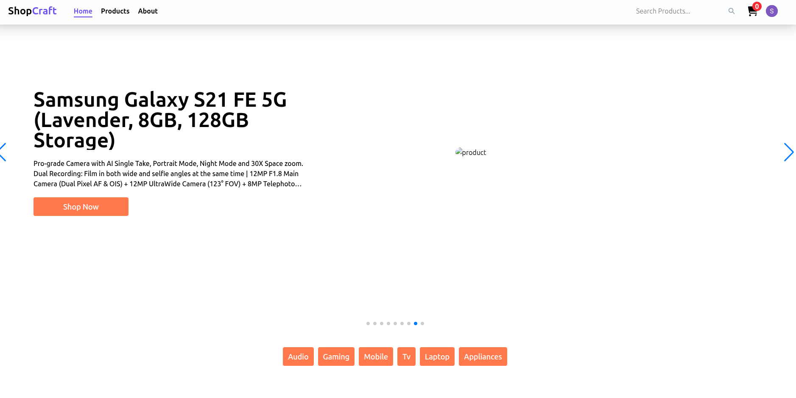
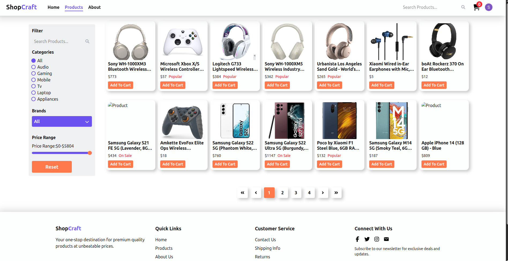
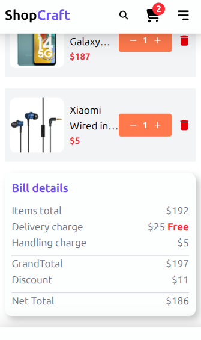
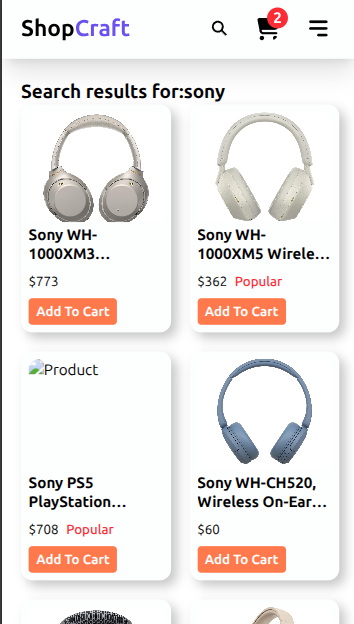

# ecommerce-app

🔗 Live Demo: [https://www.google.com/]

---

A modern, fully responsive e-commerce web application built using **React**, **Clerk** for authentication, **Fakestore API** for product data, and styled with **Tailwind CSS** 
It offers a clean shopping experience with filtering, a cart system, smooth navigation, and proper state handling.

---

## 🚀 Features

- 🔐 User Authentication (via Clerk)  
- 🛒 Cart Management with Quantity & Price Calculations  
- 🔍 Product Filtering by Category  
- 🧭 Responsive Navigation & Search Bar  
- 🪄 Toast Notifications  
- 💀 "No Product Found" UI  
- ⏳ Loading Skeletons  
- 📱 Fully Responsive Design

---

## 🧰 Tech Stack

- **React**  
- **Tailwind CSS**  
- **Clerk Auth**  
- **Fakestore API**  
- **React Router**

---

## 📸 Screenshots






---

## 📦 Getting Started

```bash
git clone https://github.com/your-username/ecommerce-app.git
cd ecommerce-app
npm install
npm run dev
